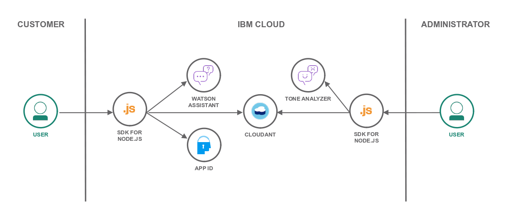

# Cloud Insurance Co. - Overview

**WORK IN PROGRESS**

Cloud Insurance Co. is a modern insurance company for the 21st century.

The following projects are leveraged in the overall Cloud Insurance Co. solution:

* [insurance-bot][bot_github_url]
* [insurance-catalog][catalog_github_url]
* [insurance-orders][orders_github_url]
* [insurance-bot-dashboard][dashboard_github_url]
* [insurance-bot-ios][mobile_github_url]

## Code Status

| :point_down: Repositories ... Branches :point_right: | master | dev |
| --- | :--- | :--- |
| [insurance-bot][bot_github_url] |  |  |
| [insurance-orders][orders_github_url] |  |  |
| [insurance-catalog][catalog_github_url] |  |  |
| [insurance-bot-dashboard][dashboard_github_url] |  |  |

## Deploy

To deploy the full system all at once, check out the [Cloud Insurance Co. Toolchain][toolchain_github_url]

## Architecture

  

## Related Blog Posts, Videos, etc

...

## License

See [License.txt](License.txt) for license information.

# Privacy Notice

The application is configured to track deployments to [IBM Bluemix](http://www.ibm.com/cloud-computing/bluemix/) and other Cloud Foundry platforms. Refer to the individual projects to understand what information is tracked and how to disable the tracking.

[bot_github_url]: https://github.com/IBM-Bluemix/insurance-bot
[orders_github_url]: https://github.com/IBM-Bluemix/insurance-orders
[catalog_github_url]: https://github.com/IBM-Bluemix/insurance-catalog
[dashboard_github_url]: https://github.com/IBM-Bluemix/insurance-bot-dashboard
[mobile_github_url]: https://github.com/IBM-Bluemix/insurance-bot-ios
[toolchain_github_url]: https://github.com/IBM-Bluemix/insurance-toolchain
